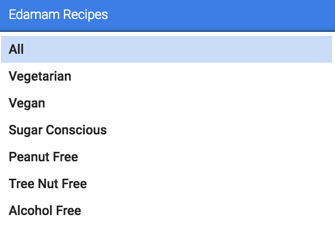
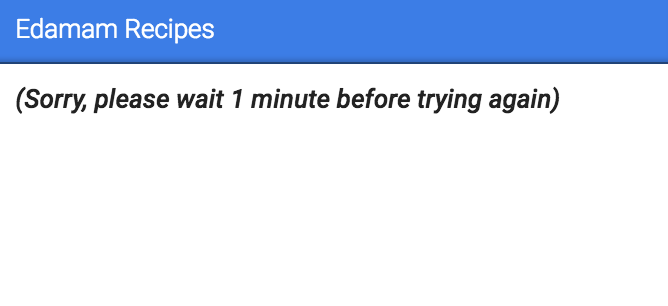

# Edamam Recipe Slash Command for Mixmax

This is an open source Mixmax Slash Command.

## Running locally

1. Install using `npm install`
2. Run using `npm start`
3. Restart chrome using the command `open -a Google\ Chrome --args --ignore-certificate-errors` to temporarily disable SSL certificate errors.
4. Open up the Mixmax Developer Dashboard and click Add Slash Command.
5. Add command accordingly, using the following parameters: 
```
Name: Edamam Recipe Search
Command: recipe
Parameter placeholder: [Search]
Typeahead API URL: https://localhost:9145/typeahead
Resolver API URL: https://localhost:9145/resolver
```
6. Refresh Gmail with Mixmax installed.
You can now use the Edmama Recipe Slash Command!

## Usage

While composing an email, type `/recipes` to start searching for a recipe. You then have a choice of choosing from a list of health labels to filter your recipes. <br>

<br>
After choosing your label, you can type in a search term to search for a recipe. <br>

<br>
Once you choose a recipe, it will be embedded within your email with a link to the original recipe. <br>

<br>

## API Call Limi

Unfortunately, the free version of the Edamam recipes API limits me to 5 calls per minute. As a result, you must wait a minute after choosing around two recipes. If you see the following, it means that the call limit has been reached: <br>

<br>

<br>
